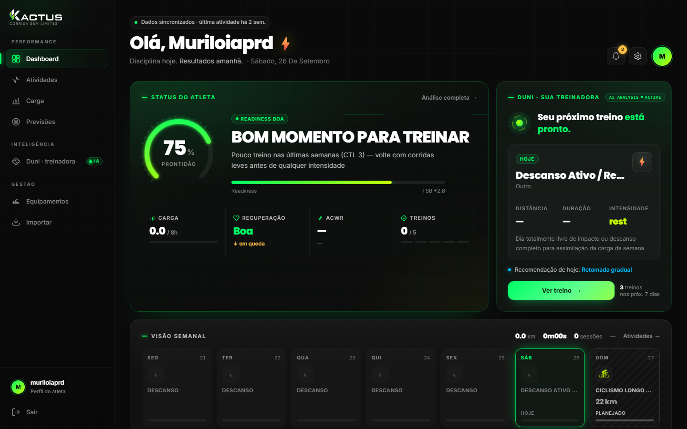
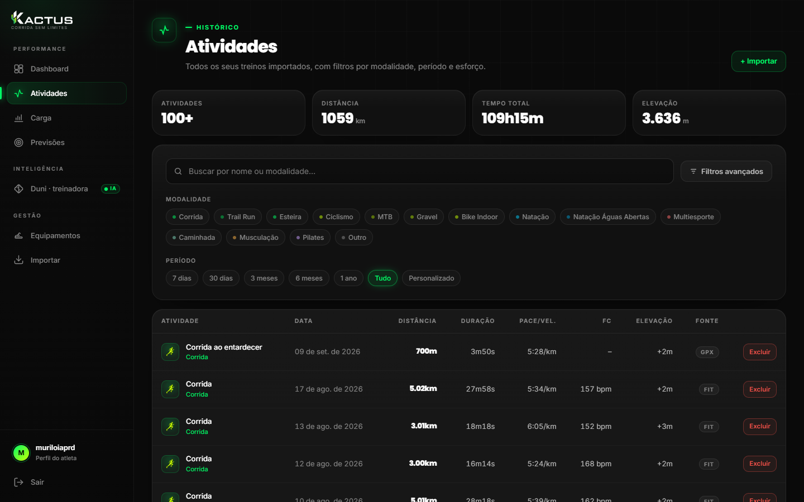
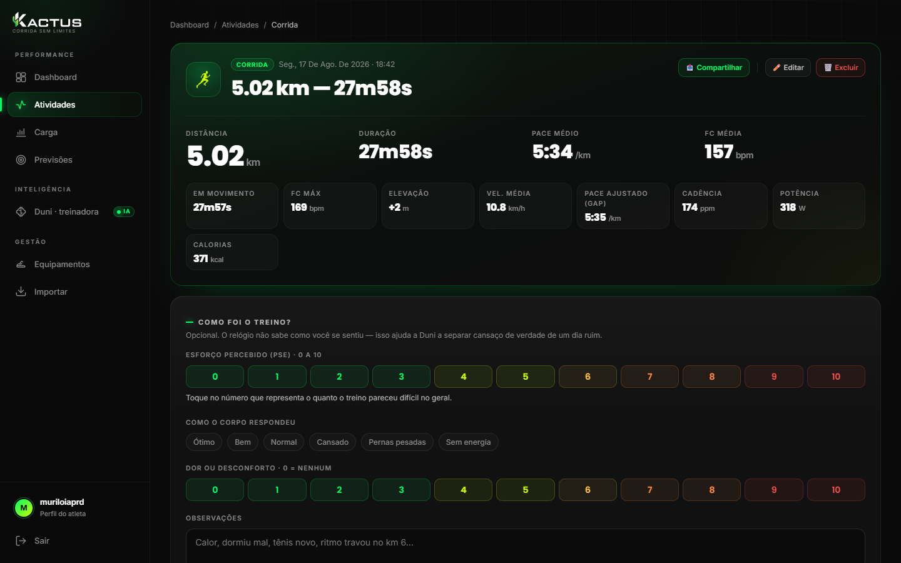
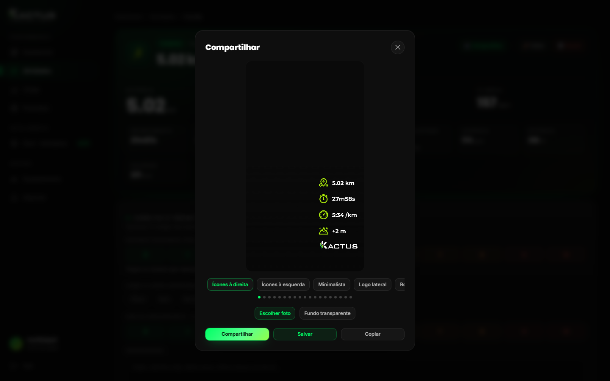
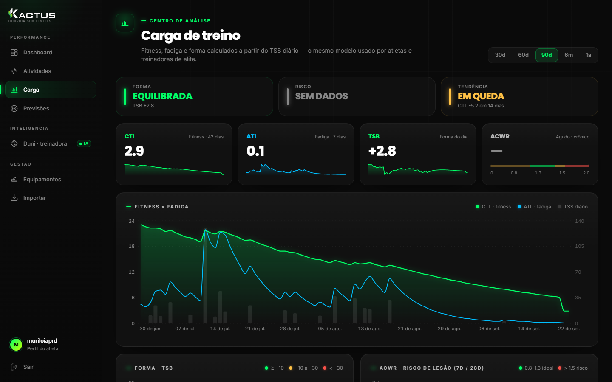
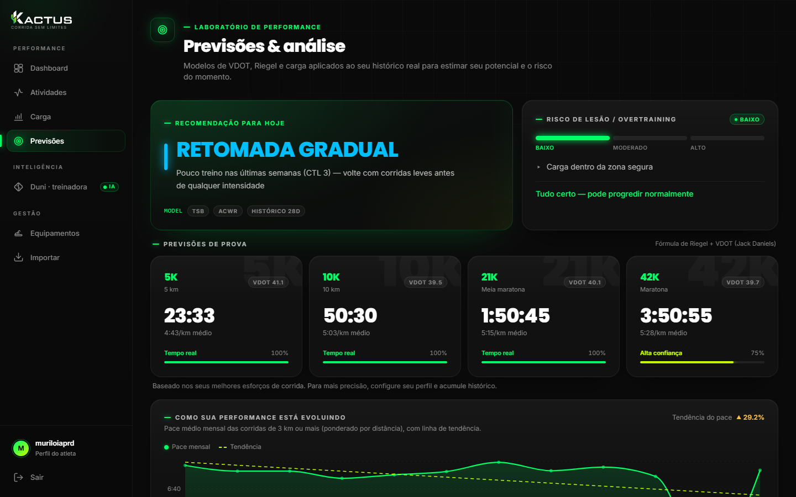
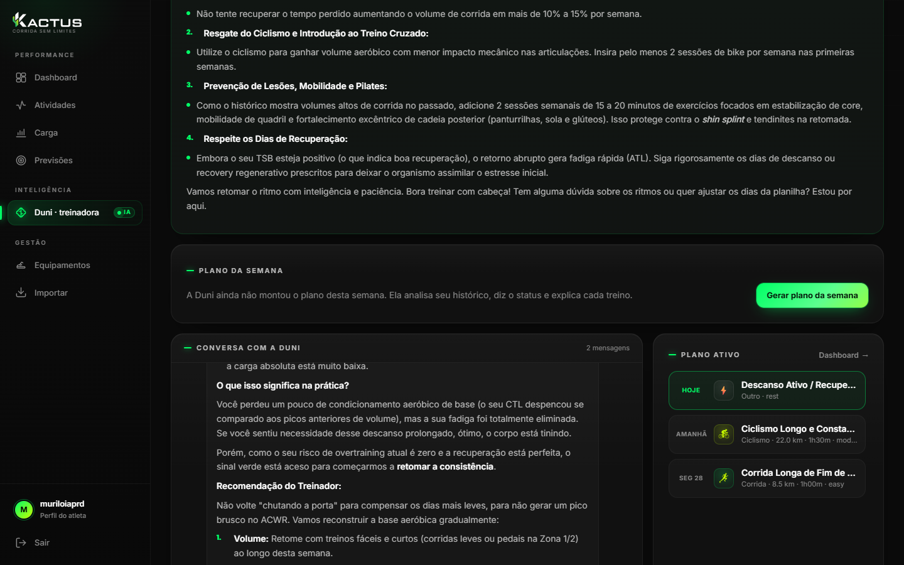

# Kactus

Plataforma pessoal de analise de treino (corrida + ciclismo + natacao) com metricas de carga (CTL/ATL/TSB/ACWR), previsoes, Treinador de IA e gerador visual proprio.

Custo mensal: R$ 0 (exceto a API da Anthropic do Treinador de IA, opcional). Uso pessoal. Sem cartao de credito.

Documentacao completa (estado, backlog, planejamento): [`docs/`](./docs/). Estado detalhado: [`docs/ESTADO_DO_PROJETO.md`](./docs/ESTADO_DO_PROJETO.md) · Pendencias: [`docs/BACKLOG.md`](./docs/BACKLOG.md)

## Screenshots

| Dashboard | Atividades |
|---|---|
|  |  |

| Detalhe da atividade | Gerador de Stories |
|---|---|
|  |  |

| Carga de treino | Previsoes |
|---|---|
|  |  |

| Treinador de IA |
|---|
|  |

## Stack

- Backend: FastAPI (Python 3.12) + SQLAlchemy 2.0 + Alembic
- Frontend: Next.js 14 (App Router) + Tailwind com design system proprio (`tailwind.config.ts`, `app/globals.css`, `lib/theme.ts`) + Recharts + Leaflet (tiles escuros CARTO)
- Banco: Neon Postgres (free tier). O `docker-compose.yml` com Postgres local ainda existe, mas nao e o fluxo usado.
- Auth: Argon2id + JWT

## Pre-requisitos

- Python 3.12+
- Node 20+
- `uv` (Python) e `pnpm` (JS) instalados globalmente

## Bootstrap (primeira vez)

```bash
cp .env.example .env
```

Gerar `JWT_SECRET_KEY` e `FERNET_KEY`:

```bash
python -c "import secrets; print(secrets.token_urlsafe(48))"
python -c "from cryptography.fernet import Fernet; print(Fernet.generate_key().decode())"
```

Cole os valores no `.env`, junto com a connection string do Neon. Para o Treinador de IA, adicione tambem `ANTHROPIC_API_KEY` e/ou `GEMINI_API_KEY`.

Instalar dependencias e rodar migrations:

```bash
cd apps/api
uv sync
uv run alembic upgrade head
uv run python -m kactus_api.scripts.seed_user
```

Instalar dependencias do frontend e do orquestrador:

```bash
cd ..
pnpm install
```

Subir tudo com um comando so, a partir da raiz `Kactus/`:

```bash
pnpm dev
```

Isso sobe a API (porta 8000, so em `127.0.0.1`, sem `--reload`) e o frontend (porta 3003) juntos, com `concurrently`. Abrir http://localhost:3003 — o proprio Next repassa `/api/*` para a API por baixo (`next.config.mjs`), entao so existe um endereco pra acessar.

Para rodar cada lado separado (ex.: debugar so a API), use `pnpm dev:api` ou `pnpm dev:web`.

> Se ja houver outro `next dev` rodando em `apps/web`, suba um extra com `NEXT_DIST_DIR=.next-preview` para nao corromper o cache compartilhado (ver `docs/ESTADO_DO_PROJETO.md`).

## Importar treinos do Garmin

Baixa o arquivo `.FIT` original de cada atividade e reusa o mesmo parser do upload manual,
entao um treino ja subido a mao nao duplica.

Primeira vez (pede a senha e, se a conta tiver MFA, o codigo):

```bash
uv run --directory apps/api python -m kactus_api.scripts.sync_garmin --email SEU@EMAIL --garmin-login
```

Depois disso o token fica em `~/.garminconnect` e renova sozinho:

```bash
uv run --directory apps/api python -m kactus_api.scripts.sync_garmin --email SEU@EMAIL
```

Sem `--since`/`--days`, o sync e incremental (parte da ultima atividade ja vinda do Garmin,
com 3 dias de margem). Use `--dry-run` para so listar, e `--limit N` para limitar o lote.

> Comando em uma linha so, sem `cd ... &&`: o PowerShell do Windows nao aceita `&&`.

> A API do Garmin usada aqui nao e oficial e pode mudar sem aviso; o upload manual continua
> funcionando como alternativa. Nenhuma credencial fica no repositorio.

## Estrutura

- `apps/api/kactus_api/` — `routers/`, `parsers/`, `metrics/` (carga, recordes, previsoes), `ai/` (Treinador de IA)
- `apps/web/app/` — paginas (dashboard, activities, metrics, predictions, coach, equipment, import, profile)
- `apps/web/components/ui/` — primitivos do design system; `components/dashboard/` — blocos do dashboard; `components/share/` — gerador de Stories
- `apps/web/lib/` — cliente da API (`api.ts`), formatacao (`utils.ts`), interpretacao de dados do atleta (`athlete.ts`), tokens JS (`theme.ts`), motor do gerador de Stories (`story/`)
